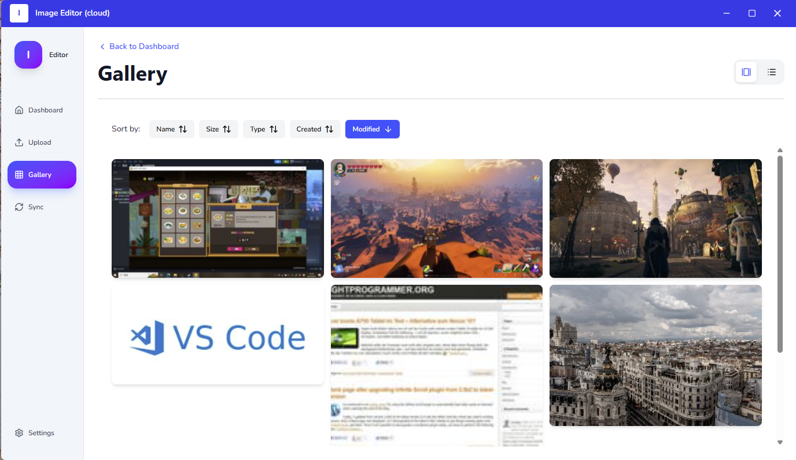

# Image Management Client


A cross-platform desktop application for managing and organizing images. Built with Electron, supports local / cloud storage mode with seamless cloud synchronization.

> **Note**: This is the Frontend Client. For the backend infrastructure, see the [Server Repository](https://github.com/XueshenWu/im-server).


<!-- Place a screenshot in docs/preview.png or delete this line -->

---

## ✨ Features

### 🖼️ Core Experience

- **Hybrid Storage**: Switch instantly between Local Mode (SQLite + AppData) and Cloud Mode (MinIO/S3)
- **Advanced Viewer**: Native support for Multi-page TIFFs with per-page cropping, PNG, and JPEG
- **Gallery Views**:
  - Photo Wall: Virtualized grid with lazy-loading thumbnails
  - Detail List: Sortable table view with metadata columns
- **EXIF Editor**: Comprehensive metadata management (Camera, GPS, Settings, Copyright, etc.)
- **Multi-Language**: Built-in support for English and French

### 🔄 Data & Sync

- **Smart Sync**:
  - Cloud Mode: Sequence-based incremental sync
  - Local Mode: Last-Write-Wins (LWW) bi-directional sync with conflict resolution
- **Dashboard**: Visual analytics of your library
  - Storage usage and image count statistics
  - Upload/delete activity timeline
  - File format distribution charts
- **Uploads**: Drag-and-drop uploader with:
  - Batch file selection and ZIP support
  - Corruption detection
  - Client-side EXIF extraction
  - Progress tracking per file

### 🎨 User Experience

- **Dark Mode**: System-aware theme switching with manual override
- **Custom Protocol Handlers**: Fast local image loading via `local-image://` and `local-thumbnail://`
- **Export Functionality**: Save images from database to filesystem


---

## 🛠 Tech Stack

| Layer          | Technology                                    |
|----------------|-----------------------------------------------|
| **Core**       | Electron 39, Vite 7, TypeScript               |
| **UI**         | React 19, Tailwind CSS 4, Radix UI            |
| **State**      | Zustand, React Router 7, TanStack Table       |
| **Data**       | SQLite3 (native), Local filesystem            |
| **Imaging**    | Sharp, UTIF, exifr                            |
| **Viz**        | Recharts                                      |
| **i18n**       | i18next, react-i18next                        |
| **HTTP**       | Axios with interceptors                       |

---

## 🚀 Getting Started

### Prerequisites

- **Node.js** (v20+ recommended)
- **Backend Services**: Ensure the Docker backend is running 

### Installation

1. **Clone the repository**
   ```bash
   git clone <repository-url>
   cd im-client
   ```

2. **Install dependencies**
   > Note: This includes compiling native modules like SQLite and Sharp.
   ```bash
   npm install
   ```

3. **Configuration**

   Create a `.env` file in the root directory to point to your backend:
   ```env
   VITE_API_URL=http://127.0.0.1.nip.io:9999
   VITE_S3_URL=http://s3.127.0.0.1.nip.io:9999
   ```

4. **Start Development**
   ```bash
   npm run dev
   ```

---

## 📦 Building for Production

We use **Electron Builder** to generate installers.

| Platform | Command                  | Output Format              |
|----------|--------------------------|----------------------------|
| Windows  | `npm run build:win`      | `.exe` (NSIS), Portable    |
| macOS    | `npm run build:mac`      | `.dmg`, `.zip`             |
| Linux    | `npm run build:linux`    | `.AppImage`, `.deb`, `.rpm`|

> **Tip**: If you just want to check the build process without type checking (faster):
> ```bash
> npm run build:win:no-check
> ```

---

## 📂 Project Structure

```
im-client/
├── electron/               # 🔌 Main Process (Node.js)
│   ├── main.ts            # Entry point, window management, IPC handlers
│   ├── preload.ts         # Context bridge for secure IPC
│   └── database.ts        # SQLite operations and schema
│
├── src/                   # ⚛️ Renderer Process (React)
│   ├── components/        # Reusable UI components
│   │   ├── common/        # LanguageSwitcher, ThemeSwitcher, HomeLink
│   │   ├── dashboard/     # Charts, stats cards, sync status
│   │   ├── gallery/       # PhotoWall (grid), DetailList (table), ExifEditor
│   │   ├── layout/        # AppLayout, Navigation, Panels, TitleBar
│   │   ├── settings/      # Source mode configuration
│   │   ├── sync/          # Export dialog, sync controls
│   │   ├── ui/            # Radix UI primitives (Button, Dialog, etc.)
│   │   ├── upload/        # Dropzone, file list with progress
│   │   └── viewer/        # ImageViewer, TiffImageViewer (multi-page)
│   │
│   ├── pages/             # Route components
│   │   ├── Dashboard.tsx  # Analytics and statistics overview
│   │   ├── Gallery.tsx    # Main image browsing interface
│   │   ├── Upload.tsx     # Drag-drop uploader
│   │   ├── Sync.tsx       # Synchronization controls
│   │   └── Settings.tsx   # Application configuration
│   │
│   ├── services/          # Business logic and API layer
│   │   ├── api.ts                 # Axios instance with interceptors
│   │   ├── images.service.ts      # Cloud image operations
│   │   ├── localImage.service.ts  # Local image operations
│   │   ├── localDatabase.service.ts # SQLite wrapper
│   │   ├── sync.service.ts        # Cloud sync API
│   │   ├── localSync.service.ts   # Local-to-cloud sync (LWW)
│   │   └── stateDiff.service.ts   # Conflict resolution logic
│   │
│   ├── stores/            # Zustand state management
│   │   ├── settingsStore.ts       # Source mode, sync policy
│   │   ├── themeStore.ts          # Dark/light theme
│   │   ├── imageViewerStore.ts    # Viewer state
│   │   ├── exifEditorStore.ts     # EXIF editing state
│   │   └── galleryRefreshStore.ts # Gallery refresh trigger
│   │
│   ├── types/             # TypeScript type definitions
│   │   ├── api.ts         # Cloud API types
│   │   ├── local.ts       # Local storage types
│   │   ├── gallery.ts     # Gallery component types
│   │   └── upload.ts      # Upload-related types
│   │
│   ├── utils/             # Helper functions
│   │   ├── thumbnailGenerator.ts  # Canvas-based thumbnail creation
│   │   ├── cropImage.ts           # Image cropping utilities
│   │   ├── imagePaths.ts          # URL generation helpers
│   │   ├── formatNormalizer.ts    # File format normalization
│   │   └── syncHelpers.ts         # Sync diff calculations
│   │
│   └── i18n/              # Internationalization
│       ├── config.ts      # i18next configuration
│       └── locales/       # Translation files (en.json, fr.json)
│
└── release/               # 📦 Binary output folder (auto-generated)
```

---

## 🐛 Troubleshooting

### 1. Native Module Mismatch (NODE_MODULE_VERSION)

If you see errors about `sqlite3` or `sharp` after switching node versions:

```bash
# Rebuild native modules
npm rebuild

# Or delete node_modules and reinstall
rm -rf node_modules && npm install
```

### 2. Images not loading from Cloud

Ensure your local backend is running and the `127.0.0.1.nip.io` domain is accessible. Check the Network tab in DevTools (`Ctrl+Shift+I`).

### 3. SQLite Database Issues

The database is stored in your system's AppData directory. To reset:

**Windows:**
```
%APPDATA%\image-management\images.db
```

**macOS:**
```
~/Library/Application Support/image-management/images.db
```

**Linux:**
```
~/.config/image-management/images.db
```

### 4. TIFF Multi-Page Loading Errors

If multi-page TIFFs fail to load, ensure Sharp is properly installed:

```bash
npm rebuild sharp --force
```

---

## 🔧 Key Architecture Decisions

### Local Mode vs Cloud Mode

**Local Mode:**
- Images stored in AppData directory
- Metadata in SQLite database
- Manual sync with LWW conflict resolution
- Works completely offline

**Cloud Mode:**
- Images stored in MinIO/S3
- Metadata fetched from backend API
- Auto-sync with configurable intervals


### Database Schema

The SQLite database contains two main tables:

1. **images**: Core metadata (filename, size, format, dimensions, hash, timestamps)
2. **exif_data**: EXIF metadata (camera info, GPS, settings, copyright)
3. **sync_metadata**: Sync state tracking (sequence, UUID, timestamps)

### IPC Communication

The app uses Electron's IPC for secure communication:
- **Main Process**: File I/O, SQLite, image processing with Sharp
- **Renderer Process**: React UI, user interactions
- **Preload Script**: Exposes safe APIs via context bridge

Custom protocol handlers (`local-image://`, `local-thumbnail://`) enable fast local image loading without reading files into memory.

---

## 📜 License

ISC
